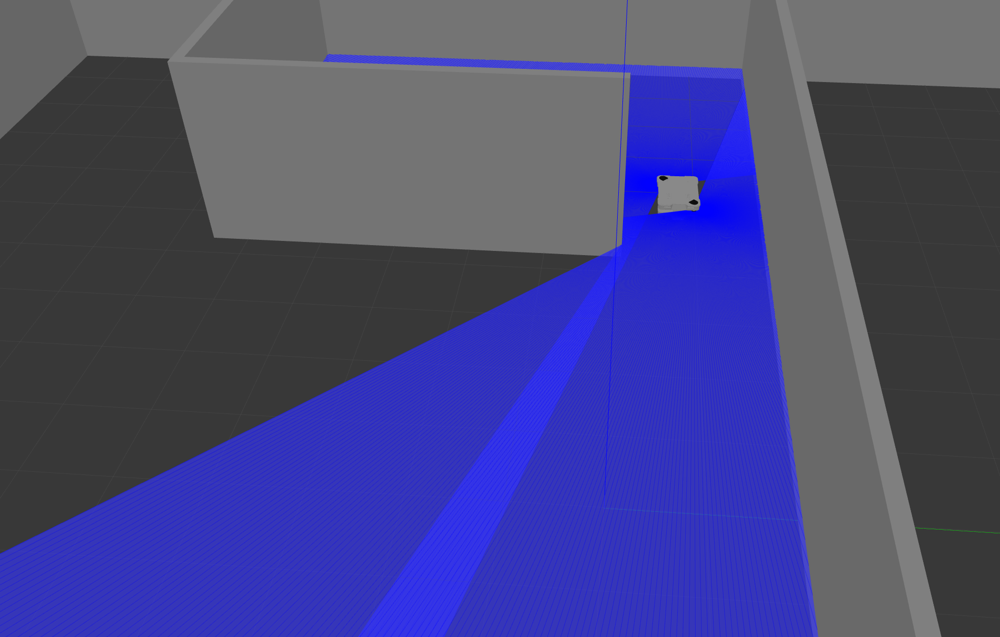
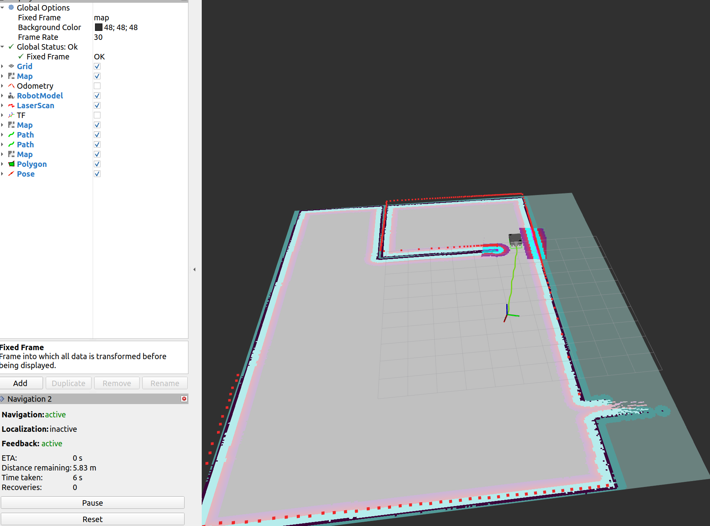

# Autonomous Mobile Manipulator (MiR 250 + UR5e + YOLO)

This repository contains a ROS 2 Humble package for simulating a **MiR 250 (Mobile Industrial Robot)** equipped with a **Universal Robots (UR5e)** arm and a **Robotiq Gripper**.

The project integrates **Navigation2**, **SLAM Toolbox**, and **YOLOv8** for autonomous navigation and object detection in a Gazebo environment.




## 🎥 Video Demo
*(Yahan apni video ka link daal dena agar future mein upload karo)*

---

## ⚡ Key Features
* **Base Setup:** Derived from the robust [mir250_robot_ros2](https://github.com/Rudresh172/mir250_robot_ros2) structure.
* **Sensor Fusion:** Merges dual laser scanners (Front & Back) using `ira_laser_tools` for 360° coverage.
* **Perception:** Real-time object detection using **YOLOv8** (CUDA-accelerated) via `ros2_run`.
* **Manipulation:** UR5e arm control with MoveIt and `ros2_control`.
* **Synchronization:** Implements `twist_stamper` to fix TF synchronization issues for velocity commands.

---

## 📦 Installation

### 1. Preliminaries (ROS 2)
Ensure you have [ROS 2 Humble](https://docs.ros.org/en/humble/Installation/Ubuntu-Install-Debians.html) installed on Ubuntu 22.04.

### 2. Setup Workspace
Create a workspace and clone this repository:
```bash
mkdir -p ~/ros2_ws_simulation/src
cd ~/ros2_ws_simulation/src

# Clone this repository
git clone <YOUR_GITHUB_REPO_LINK_HERE> .

Step A: Import External Repos (via vcs)
# Ensure vcstool is installed
sudo apt install python3-vcstool

# Import dependencies defined in ros2.repos (e.g., mir_robot, ur_description)
vcs import < ros2.repos . --recursive

Step B: Install ROS Dependencies (rosdep)
cd ~/ros2_ws_simulation
sudo apt update
sudo apt install -y python3-rosdep
sudo rosdep init
rosdep update
rosdep install --from-paths src --ignore-src -r -y --rosdistro humble


Step C: Install Python Libraries (YOLO & Vision)
pip install ultralytics opencv-python opencv-contrib-python
# Install PyTorch with CUDA support (verify your CUDA version)
pip3 install torch torchvision --index-url [https://download.pytorch.org/whl/cu121](https://download.pytorch.org/whl/cu121)


4. Build the Project
cd ~/ros2_ws_simulation
colcon build --symlink-install
source install/setup.bash

🖥️ Usage
1. Launch Simulation (Gazebo)
To spawn the MiR 250 with UR arm and start the laser merger nodes:
ros2 launch mir_gazebo mir_simulation_launch.py world:=maze

2. Navigation & Mapping

To start SLAM (Mapping):
ros2 launch mir_navigation mapping.py use_sim_time:=true

To start Navigation (AMCL + Nav2):
ros2 launch mir_navigation navigation.py use_sim_time:=true

🙏 Acknowledgements & Credits
This project is built upon the excellent work done by Rudresh Lonkar.
Base Project Inspiration: mir250_robot_ros2 by Rudresh172.

MiR Descriptions: DFKI-NI/mir_robot.

Universal Robots: Universal_Robots_ROS2_Description.

Laser Tools: dual_laser_merger.

